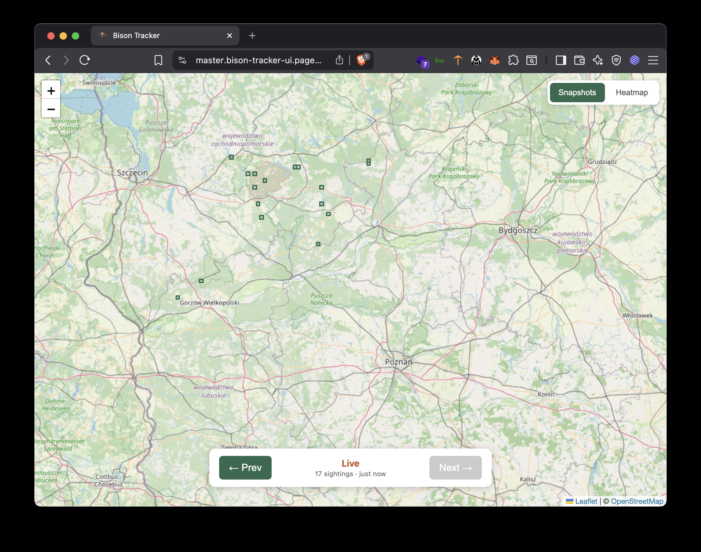

# Bison Tracker

A Cloudflare Worker that scrapes a public GeoJSON API for European bison (żubr) herd locations in western Poland every 2 hours and stores parsed sighting data in a Cloudflare D1 database. Includes a REST API for querying historical data and a map UI for browsing sightings over time.

**Live UI:** [https://master.bison-tracker-ui.pages.dev/](https://master.bison-tracker-ui.pages.dev/)
**API base:** `https://bison-tracker.bison-tracker.workers.dev`



## Prerequisites

- Node.js 18+
- Cloudflare account
- Wrangler CLI (installed via `npm install`)

## Setup

```bash
git clone <repo-url>
cd bison-tracker
npm install
npx wrangler login
```

Create the D1 database:

```bash
npx wrangler d1 create bison-tracker-db
```

Update `database_id` in `wrangler.toml` with the ID from the previous step, then apply the schema:

```bash
npx wrangler d1 execute bison-tracker-db --file=./schema.sql
```

## Local Development

Start the Worker locally:

```bash
npm run dev
```

Test the cron trigger locally:

```bash
curl "http://localhost:8787/__scheduled?cron=0+*/6+*+*+*"
```

Serve the UI locally with Vite (requires updating `API_BASE` in `ui/src/api.ts` to `http://localhost:8787`):

```bash
npm run ui
```

## Tests

```bash
npm test
```

## Deployment

Deploy the Worker (API + scraper):

```bash
npm run deploy
```

Deploy the UI to Cloudflare Pages:

```bash
npm run deploy:ui
```

On first deploy, apply the schema to the remote D1 database:

```bash
npx wrangler d1 execute bison-tracker-db --file=./schema.sql --remote
```

## UI

The `ui/` directory contains a single-page map application built with Svelte 5, TypeScript, Leaflet, and Vite. It displays bison sighting rectangles on a map of western Poland (Poznań–Wałcz area) and lets you step through snapshots over time with Prev/Next controls.

On load the UI fetches live data from the source API (proxied through the Worker) and displays it as the default view. Historical snapshots are loaded in batches of 50 and cached client-side for fast navigation. Older batches are prefetched automatically as you approach the end of the loaded data.

A toolbar in the top-right corner lets you toggle between the snapshot view and a frequency heatmap that aggregates all historical sightings, showing which areas bison visit most often.

The UI is mobile-friendly and can be pinned to the iOS home screen as a web app.

## API


| Method | Path                    | Description                                                             |
| ------ | ----------------------- | ----------------------------------------------------------------------- |
| GET    | `/api/snapshots`        | List snapshots (paginated via `limit` and `offset`)                     |
| GET    | `/api/snapshots/recent` | Recent snapshots with sightings (cursor-based via `limit` and `before`) |
| GET    | `/api/snapshots/live`   | Live proxy of the source API (cached for 5 min on the edge)             |
| GET    | `/api/snapshots/latest` | Most recent stored snapshot with sightings                              |
| GET    | `/api/snapshots/:id`    | Specific snapshot with its sightings                                    |
| GET    | `/api/heatmap`          | Frequency heatmap of sighting locations (`months` param, cached 6 hrs)  |


### Examples

```bash
# Recent snapshots with sightings (batch)
curl "https://bison-tracker.bison-tracker.workers.dev/api/snapshots/recent?limit=10"

# Live data from source
curl "https://bison-tracker.bison-tracker.workers.dev/api/snapshots/live"

# Latest stored snapshot
curl "https://bison-tracker.bison-tracker.workers.dev/api/snapshots/latest"

# Specific snapshot
curl "https://bison-tracker.bison-tracker.workers.dev/api/snapshots/1"

# Heatmap (last 12 months by default)
curl "https://bison-tracker.bison-tracker.workers.dev/api/heatmap?months=6"
```

## Architecture

Single Cloudflare Worker handling both scheduled scraping (every 2 hours) and API serving. The UI is a static site hosted on Cloudflare Pages.

## Data Source

GeoJSON API: [https://www.zubry.hmcloud.pl/bisonlife/mapa/map_files/gj_public/aktualne_kwadraty.geojson](https://www.zubry.hmcloud.pl/bisonlife/mapa/map_files/gj_public/aktualne_kwadraty.geojson)